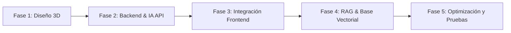
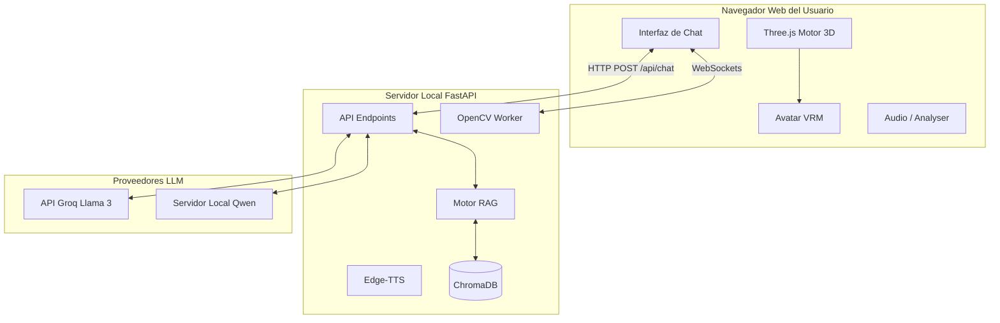

# 🎓 Guía de Defensa: Asistente Virtual Interactivo con IA y RAG

Este documento está diseñado para prepararte exhaustivamente para la defensa de tu proyecto de tesis/grado. Contiene toda la jerga técnica, diagramas y explicaciones estructuradas sobre cómo funciona el sistema bajo el capó.

---

## 1. Resumen Ejecutivo del Proyecto
El proyecto consiste en el desarrollo de un **Asistente Virtual Universitario Interactivo**. Combina un modelo 3D renderizado en tiempo real en el navegador web con un backend robusto en Python. El asistente es capaz de "ver" al usuario mediante Visión Artificial (OpenCV), interactuar de manera conversacional mediante Modelos de Lenguaje Grande (LLMs) y sintetizar voz dinámicamente (TTS). La inteligencia del asistente está anclada a documentos institucionales reales mediante la arquitectura **RAG (Retrieval-Augmented Generation)**, evitando alucinaciones y garantizando respuestas precisas sobre la carrera de Tecnologías de la Información.

---

## 2. Metodología de Desarrollo
> [!NOTE]
> Para la defensa, puedes mencionar que utilizaste una metodología de desarrollo **Iterativa e Incremental (Ágil)**.

Comenzamos con un MVP (Producto Mínimo Viable) que solo mostraba el modelo 3D. En iteraciones posteriores, agregamos la conexión al LLM, luego la visión artificial y finalmente refinamos la precisión del conocimiento integrando RAG.

---

## 3. Arquitectura del Sistema
El proyecto sigue una arquitectura **Cliente-Servidor**.
- **Frontend (Cliente):** HTML, Vanilla JavaScript y Three.js.
- **Backend (Servidor):** Python con el framework FastAPI.

---

## 4. El Cerebro del Sistema: RAG (Retrieval-Augmented Generation)

> [!IMPORTANT]
> Esta es la parte más técnica y la que más le interesará al tribunal. Debes explicar que un LLM genérico no sabe nada sobre la Universidad Indoamérica, por lo que tuvimos que inyectarle ese conocimiento sin entrenar el modelo desde cero.

### Flujo de RAG en nuestro proyecto:
1. **Ingesta de Datos (Indexación):**
   - Utilizamos un archivo PDF oficial. 
   - El script `build_rag_index.py` utiliza `pymupdf4llm` para leer el PDF y convertir sus elementos (especialmente tablas) a un formato estructurado llamado **Markdown**.
   - Luego, el texto se divide en *Chunks* (fragmentos) de 2500 caracteres, respetando las tablas y listas gracias al `MarkdownTextSplitter`.
   - Cada *chunk* pasa por un modelo neuronal ligero (`sentence-transformers/all-MiniLM-L6-v2`) que lo convierte en un **Vector Matemático (Embeddings)**.
   - Estos vectores se guardan en la base de datos local **ChromaDB**.

2. **Recuperación (Retrieval):**
   - Cuando el usuario pregunta: *"¿Cuáles son los niveles de la carrera?"*, el servidor toma esa frase y aplica **Query Expansion** (Expansión de consulta). Esto significa que el código añade sinónimos en secreto (ej. *"niveles", "malla curricular", "semestres"*).
   - Se calcula el vector de esta frase expandida y se busca en ChromaDB por **Similitud del Coseno** para encontrar los fragmentos de texto más matemáticamente parecidos.

3. **Generación (Augmented Generation):**
   - El backend toma la pregunta original del usuario, adjunta los fragmentos recuperados del PDF y se lo envía al modelo (Qwen o Groq) con la instrucción estricta de basar su respuesta únicamente en esos fragmentos.

---

## 5. Modelos de Lenguaje: Nube vs Local

Debes defender por qué el proyecto soporta múltiples proveedores de IA, cambiando una simple variable en el archivo `.env`:

- **API Groq (Llama 4 / Modelos Open Source):**
  - **Ventaja:** Groq utiliza hardware especializado (LPUs) que permite respuestas en tiempo real (instantáneas). Es ideal para mantener una conversación fluida con el avatar sin que el usuario tenga que esperar.
- **Servidor Local (Qwen 14B vía OpenWebUI):**
  - **Ventaja:** Total privacidad de los datos. El sistema puede funcionar sin conexión a internet y la información universitaria no sale a servidores externos.
  - **Desventaja (Por qué es lento):** Un modelo de 14 billones de parámetros es sumamente pesado. Si el servidor (la máquina con IP `63.141.255.7`) no cuenta con múltiples GPUs empresariales de última generación, procesar el contexto (miles de palabras del RAG) y generar la respuesta carácter por carácter toma entre 10 y 20 segundos, lo que ralentiza la interacción.

---

## 6. Frontend: El Avatar 3D y su Interactividad

El aspecto visual no es un simple video, es un modelo 3D renderizado en tiempo real usando **Three.js** y la librería `@pixiv/three-vrm`.

### Creación del Avatar
El avatar se diseñó en **VRoid Studio**, lo que permite exportar un estándar japonés llamado `.vrm`, el cual incluye estructura ósea (huesos) y "Blendshapes" (formas clave para las expresiones faciales).

### Interacciones
- **Seguimiento del Ratón (Mouse Tracking):** El sistema captura las coordenadas X/Y del cursor, las normaliza matemáticamente, y aplica trigonometría (`Lerp`) para rotar sutilmente los huesos del cuello (`head`) y los ojos (`leftEye`, `rightEye`). El avatar hace contacto visual con el usuario.
- **Lip-Sync (Sincronización Labial):** Cuando el backend devuelve el audio generado por la voz sintética (Edge-TTS), un analizador de frecuencias en JavaScript mide los decibelios del audio en tiempo real y abre o cierra la mandíbula del avatar en proporción al volumen de la voz.
- **Movimientos Orgánicos:** Usando funciones seno y coseno en el bucle de animación, logramos que los brazos estén relajados, los hombros suban y bajen simulando la respiración, y haya un parpadeo aleatorio cada ciertos segundos.

---

## 7. Preguntas Frecuentes del Tribunal (FAQ de Defensa)

**Tribunal:** *"¿Por qué usaron RAG en lugar de hacer 'Fine-Tuning' (Ajuste Fino) del modelo?"*
**Respuesta:** El Fine-Tuning es extremadamente costoso en tiempo y hardware, y sirve para cambiar el "comportamiento" o el "tono" del modelo, no para enseñarle datos precisos. RAG nos permite actualizar el conocimiento (si cambia la malla curricular) simplemente reemplazando un PDF, sin tener que reentrenar el modelo, evitando además el problema de las alucinaciones.

**Tribunal:** *"¿Cómo maneja el sistema la privacidad?"*
**Respuesta:** El sistema es modular. Al contar con soporte para OpenWebUI y Qwen local, la arquitectura puede desplegarse en una red interna (Intranet) sin enviar ningún dato del estudiante a APIs de terceros como Google o OpenAI.

**Tribunal:** *"¿Para qué usan OpenCV?"*
**Respuesta:** Se utiliza como un 'Agente Sensorial'. Mediante la cámara web, el sistema aplica clasificadores Haar Cascades para detectar rostros. Al detectar presencia física, se emite una señal por WebSockets al frontend para que el avatar pueda iniciar la interacción, mejorando la inmersión del asistente virtual.

**Tribunal:** *"¿Por qué la IA tenía problemas para leer las tablas del PDF al principio?"*
**Respuesta:** Los extractores de texto tradicionales leen los PDFs de forma lineal, lo que destruye las columnas de las tablas. Lo solucionamos implementando `pymupdf4llm`, que convierte las tablas visuales en estructuras de Markdown (`| Materia |`), formato que los modelos de lenguaje modernos entienden a la perfección.
